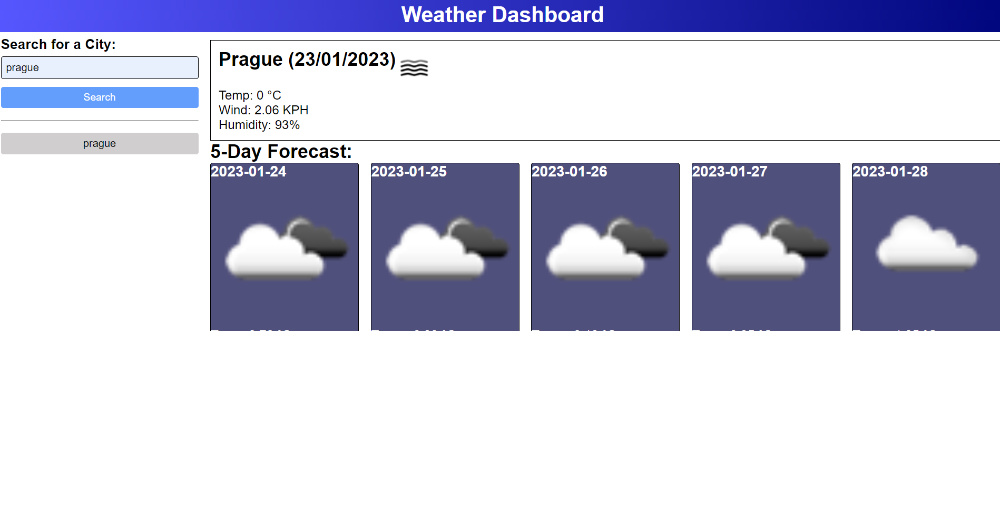

> A weather report dashboard that displays the current date. Allows the user to search for the current and 5 day weather in the city of their choice. Stores the search history and creates a button that allows the user to easily click and bring up the previous search history.
## Table of contents

- [General info](#general-info)
- [Screenshots](#screenshots)
- [Technologies](#technologies)
- [Setup](#setup)
- [Live Application](#live-application)
- [Features](#features)
- [Status](#status)
- [Contact](#contact)

## General info

Made with MomentJS to fetch current time and to practise jQuery plus setting and retreiving items from local storage. Uses the https://openweathermap.org/ API

## Screenshots

## Technologies

- HTML
- CSS
- JavaScript
- jQuery
- MomentJS
- https://openweathermap.org/ API

## Setup

- Open the index.html in any modern browser
- Type required city into the text box
- Click search button

## Live Application

https://sbillsborough.github.io/weather-dashboard/

## Features

- Displays current date on page load
- Stores search history to local storage
- Current and 5 day weather forecast
- Clickable buttons that search for their relevant weather

To-do list:

- Buttons aren't clickable until the page is refreshed
- Buttons are repeatedly added after a button is clicked

## Status

Project is: _in progress_

## Contact

Created by [billsboroughscott@gmail.com] - feel free to contact me!